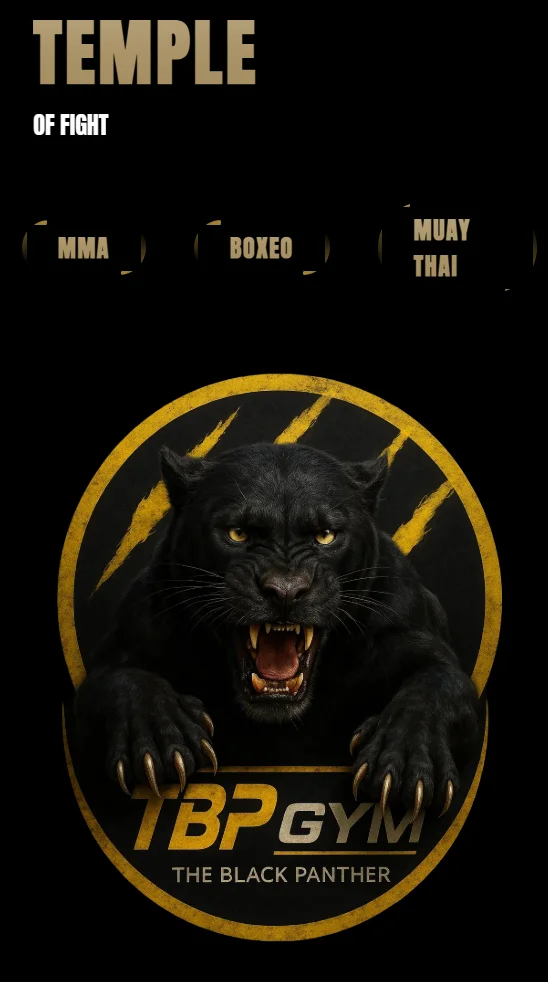
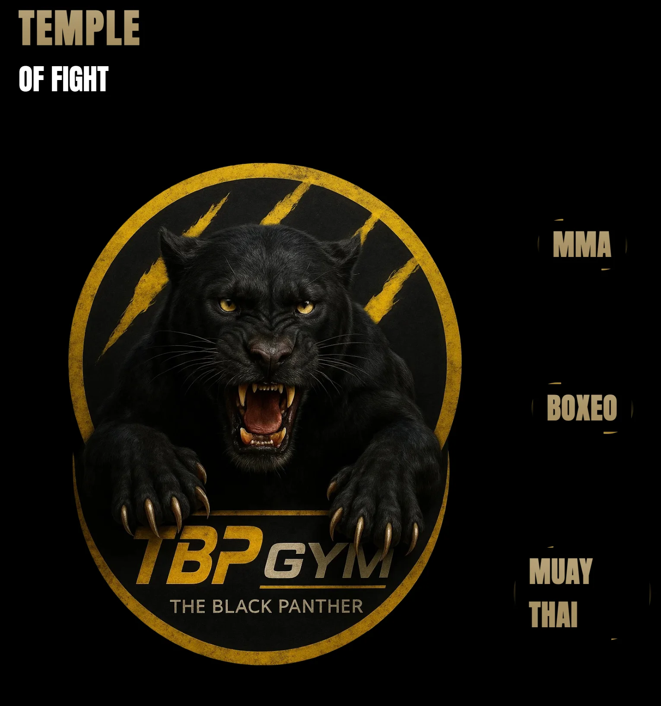

# 🥊 Team of Fight – Ranking App (En proceso de construccion)

Proyecto en Angular 19 standalone que muestra rankings de luchadores por disciplina (MMA, Muay Thai y Boxeo), con animaciones usando GSAP y estilos en SCSS.

## 🚀 Tecnologías

- Angular 19 (standalone)
- GSAP para animaciones
- SCSS para estilos
- Estructura por componentes

## 📁 Estructura actual

src/
├── app/
│   ├── core/          # Componentes principales como header y footer
│   ├── pages/         # Páginas principales: MMA, Muay Thai, Boxeo
│   ├── shared/        # Componentes compartidos: miniatura-luchador, ranking,

## 🎯 Objetivo inicial

- Mostrar un podio con los 3 mejores luchadores
- Tabla de ranking debajo
- Lista de miniaturas por luchador
- Al hacer click en un luchador, mostrar su árbol de combates

## 🏢 Proyecto para la empresa

[The Black Panther Gym](https://theblackpanthergym.com/)

## 🌐 Vista previa del proyecto(Vercel)

[Temple of Fight](https://temple-of-fight.vercel.app/home)

## 📸 Imágenes del proyecto

### Home

