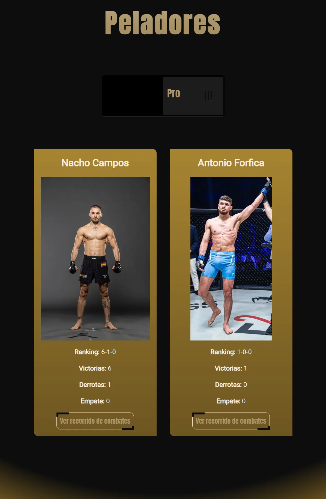
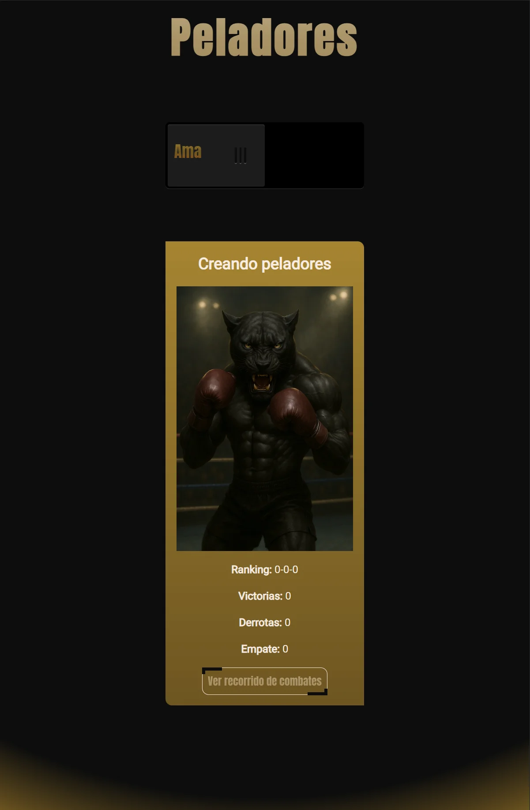
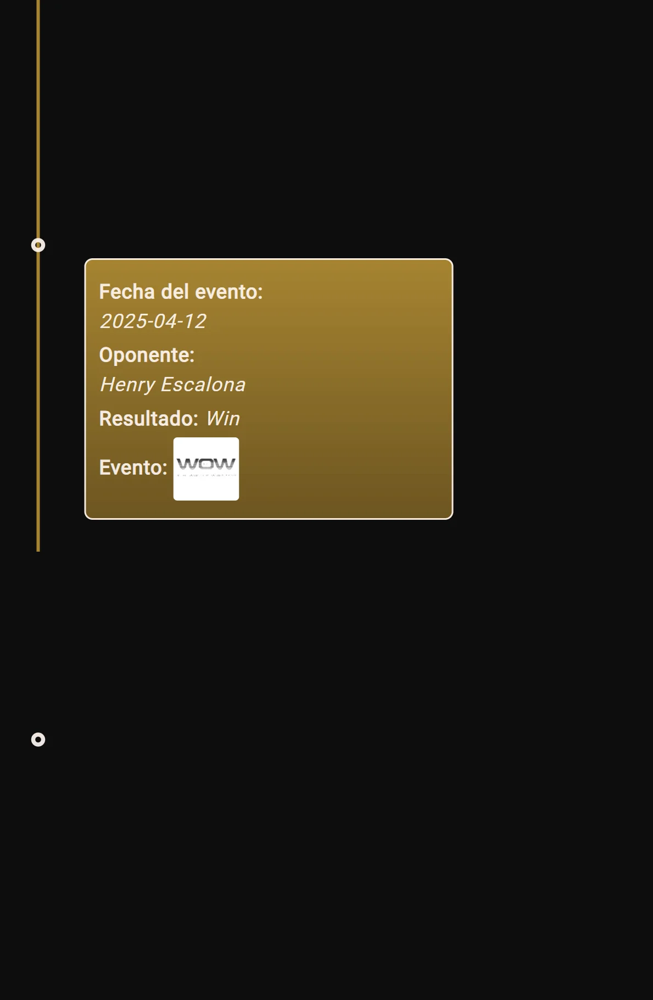

# 🥊 Team of Fight – Dossier de competidores

Proyecto en Angular 19 standalone que muestra rankings de luchadores por disciplina (MMA, Muay Thai y Boxeo), con animaciones usando GSAP y estilos en SCSS.

## 🚀 Tecnologías

- Angular 19 (standalone)
- GSAP para animaciones
- SCSS para estilos
- Arquitectura basada en componentes reutilizables

## 📁 Estructura actual

src/app/
├── core/          # Lógica base del proyecto: datos estáticos y servicios
├── home/          # Página principal con entrada visual y animaciones GSAP
├── pages/         # Renderizado específico por disciplina: MMA, Boxeo, Muay Thai
├── shared/        # Componentes reutilizables con toda la lógica funcional
├── models/        # Definición de modelos de datos

🔧 core/

Contiene los datos estáticos organizados por disciplina, así como servicios centralizados (discipline.service.ts, fighters.service.ts). Esta capa está pensada para ser fácilmente reemplazable en el futuro por una fuente dinámica de datos (API REST o Firebase), sin afectar al resto del proyecto.

🧩 shared/

Contiene los componentes inteligentes: son los que manejan la lógica principal, transformaciones de datos, animaciones y visualización. Ejemplos:

career.component: gestiona el árbol de combates.

discipline.component: vista general de cada disciplina.

fighters.component: miniaturas con interacción.

Esta capa actúa como nexo lógico entre los datos y las vistas.

📄 pages/
Se limita al renderizado visual por disciplina. Los componentes aquí no contienen lógica propia, sino que simplemente componen y organizan los elementos de shared/ para cada vista.

## 🎯 Objetivo inicial

- Hacer un dossier de todos los competidores disponibles en todas las disciplinas, y niveles.

- Al hacer clic en un luchador, ver sus características físicas y ver su árbol genealógico de combates, representado mediante SVG y animado con GSAP

- Diseño responsive adaptado a móvil, tablet y escritorio

## 🏢 Proyecto para la empresa

[The Black Panther Gym](https://theblackpanthergym.com/)

## 🌐 Vista previa del proyecto(Vercel)

[Temple of Fight](https://temple-of-fight.vercel.app/home)

## 📸 Imágenes del proyecto

### Home

### Page boxeo, mma o muay thai

### Page career

